Exploring the GPOF data
================
Will Hall
05/02/2021

-   [Overview](#overview)
-   [By trait](#by-trait)
    -   [Responsible](#responsible)
    -   [Trustworthy](#trustworthy)
    -   [Disciplined](#disciplined)
    -   [Competence](#competence)
    -   [Intelligent](#intelligent)
    -   [Resourceful](#resourceful)
    -   [Sincere](#sincere)
    -   [Skillful](#skillful)
    -   [Warmth](#warmth)
    -   [Friendly](#friendly)
    -   [Happy](#happy)
-   [Overall](#overall)

## Overview

The outcome variables in these plots come from the variables called
`AGEN_WORK_..`, `COMM_WORK_..`, etc. in the SPSS file you sent. I
created plots for each rating type, e.g., Responsible, Trustworthy,
etc., and for an overall composite of all the rating type.

Looking at the patterns of data in these plots, gender doesn’t seem to
be a very salient cue for participants. The patterns for the male and
female targets are very consistent. There does seem to be a suggestion
that forgetting to do something at work (especially if it’s a communal
task) is judged more negatively than forgetting something at home –
regardless of target gender.

## By trait

### Responsible

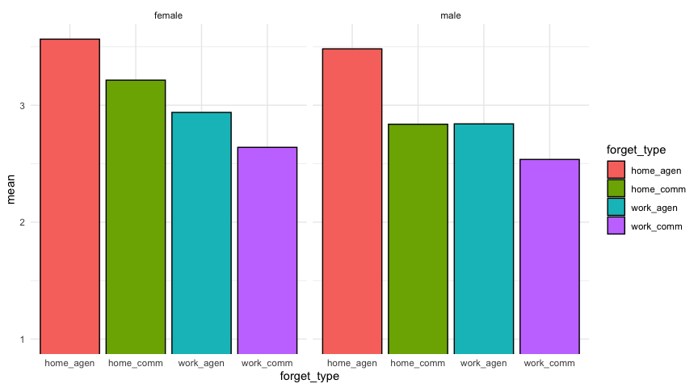<!-- -->

### Trustworthy

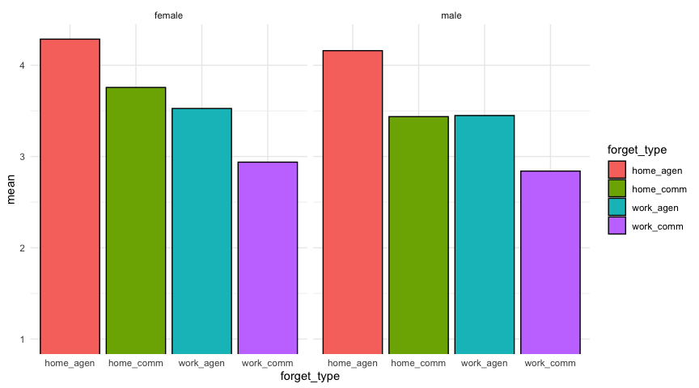<!-- -->

### Disciplined

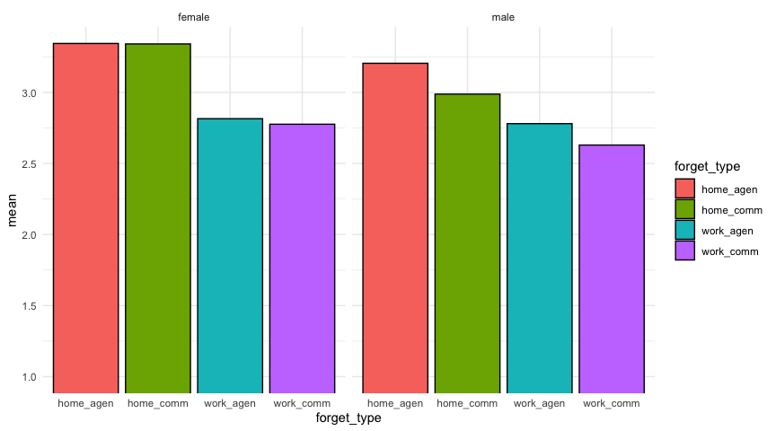<!-- -->

### Competence

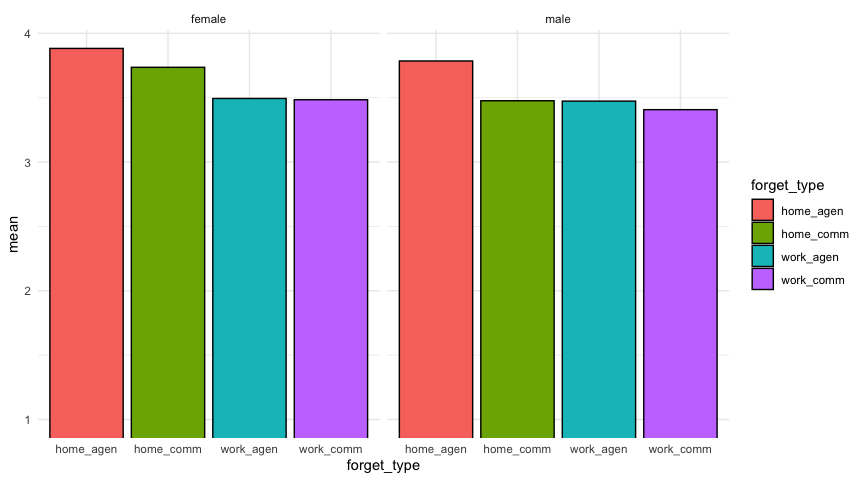<!-- -->

### Intelligent

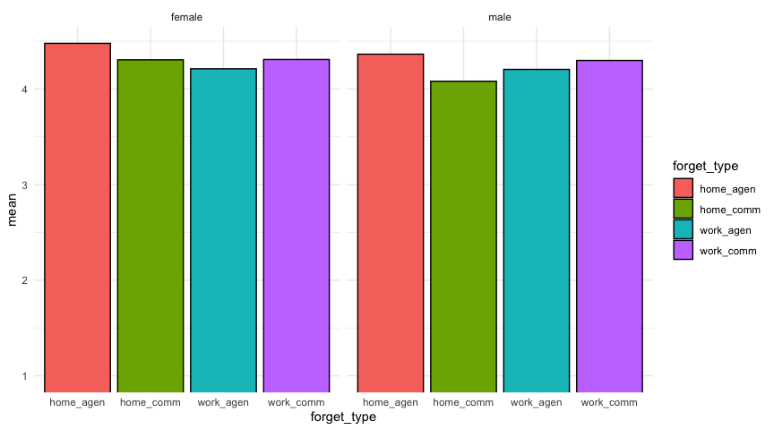<!-- -->

### Resourceful

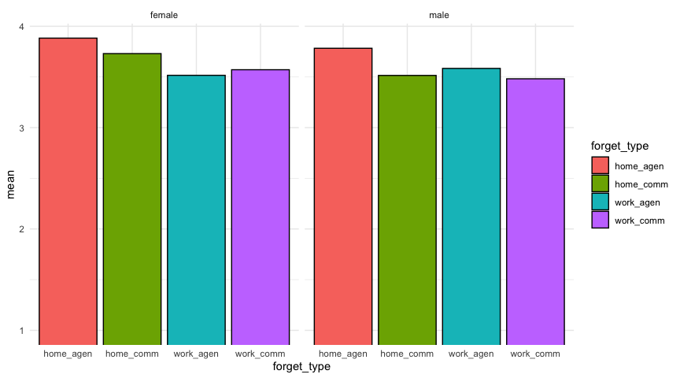<!-- -->

### Sincere

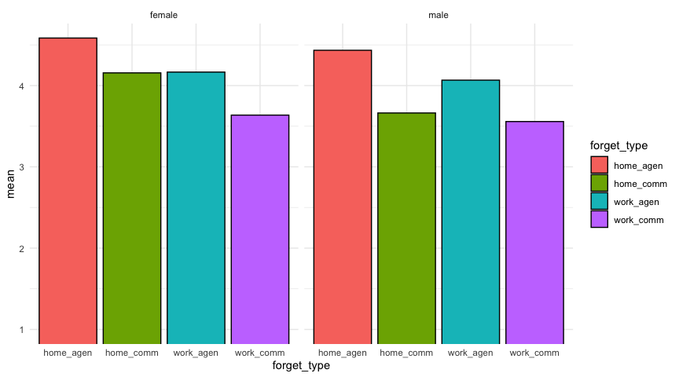<!-- -->

### Skillful

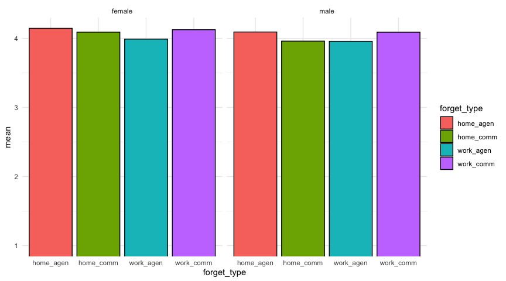<!-- -->

### Warmth

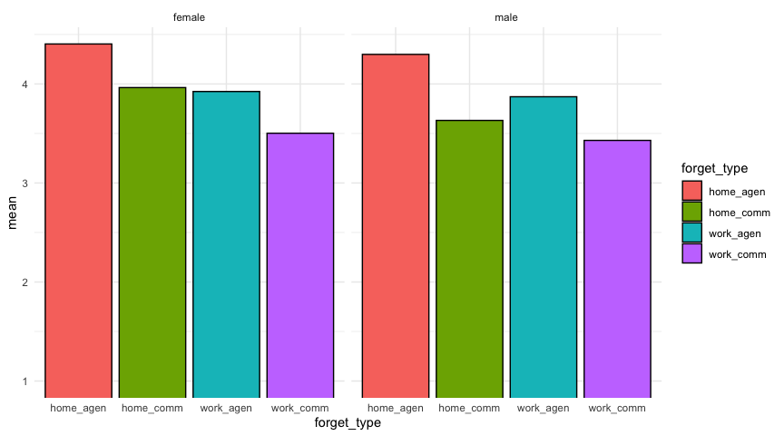<!-- -->

### Friendly

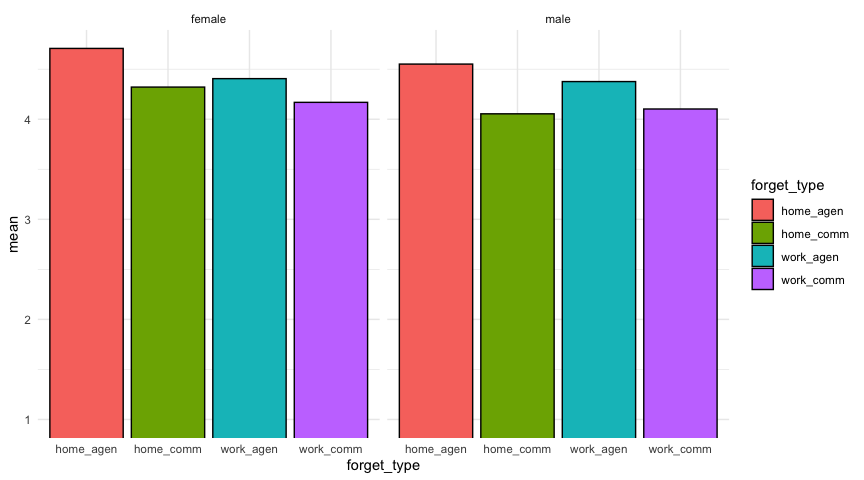<!-- -->

### Happy

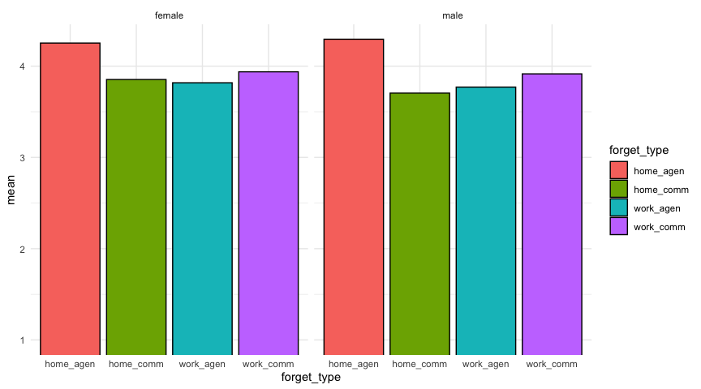<!-- -->

## Overall

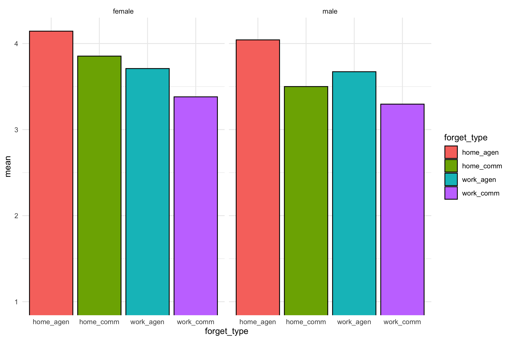
