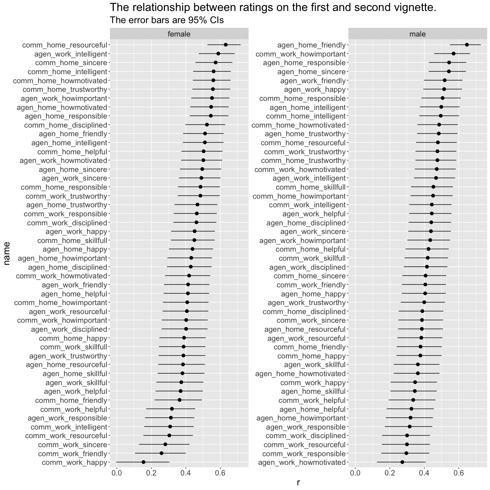
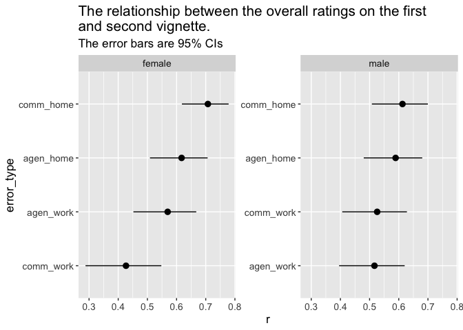

gpof item correlations
================
Will Hall
07/02/2021

## Overview

These plots show the correlations between the first and second vignette
for the different vignette types. For both plots, the x-axis is the
correlations coefficient (*r*). The y-axis is ordered by the strength of
the relationship.

## Item level correlations

This plot shows the correlations at the item level. E.g., what is the
correlation between `Agen_Work_Skillful_1` and `Agen_Work_Skillful_2`.

``` r
p1 + theme(text = element_text(size=40))
```

<!-- -->

## Overall relationships

This plot shows the correlations between the two composite ratings for
each error type. E.g., what’s the correlation between the two vignettes
about forgetting something agentic at work.

``` r
p2
```

<!-- -->
